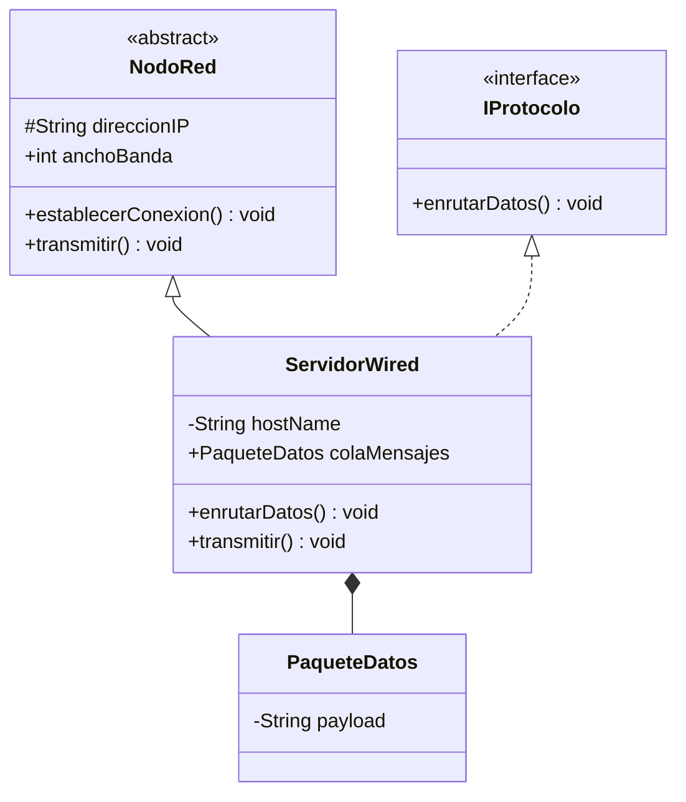
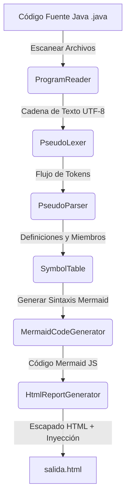

# ✦ Manual de Usuario y Documentación Técnica: Traductor de Java a Mermaid JS ✦

Este manual te guiará paso a paso sobre cómo utilizar **JUMeL**, una herramienta avanzada de traducción de compiladores diseñada para analizar código fuente escrito en **Java** y convertirlo automáticamente en un **Diagrama de Clases UML interactivo** a través de la sintaxis de **Mermaid JS**, exportado en un archivo **HTML interactivo premium**.

---

## ✦ Tabla de Contenidos
1. [Presentación del Traductor](#1-presentación-del-traductor)
2. [Características Soportadas](#2-características-soportadas)
3. [Requisitos Previos del Sistema](#3-requisitos-previos-del-sistema)
4. [Guía de Uso Paso a Paso (Manual del Usuario)](#4-guía-de-uso-paso-a-paso-manual-del-usuario)
   - [Paso 1: Compilación de la Herramienta](#paso-1-compilación-de-la-herramienta)
   - [Paso 2: Ejecución de la Traducción](#paso-2-ejecución-de-la-traducción)
   - [Paso 3: Visualización del Reporte Interactivo](#paso-3-visualización-del-reporte-interactivo)
5. [Ejemplo Completo de Entrada y Salida](#5-ejemplo-completo-de-entrada-y-salida)
6. [Arquitectura y Funcionamiento Interno](#6-arquitectura-y-funcionamiento-interno)
   - [Flujo de Procesamiento General](#flujo-de-procesamiento-general)
   - [Fases del Proceso de Traducción](#fases-del-proceso-de-traducción)
7. [Resolución de Problemas Técnicos (Troubleshooting)](#7-resolución-de-problemas-técnicos-troubleshooting)
8. [Autores e Integrantes](#8-autores-e-integrantes)

---

## 1. Presentación del Traductor

El **Traductor de Java a Mermaid JS** es una herramienta que analiza la estructura sintáctica y semántica del código fuente de Java para extraer sus clases, interfaces, atributos y métodos, identificando automáticamente cómo se relacionan entre sí.

El resultado final no es solo texto plano de Mermaid JS, sino un archivo **HTML premium responsivo (`salida.html`)** que renderiza el diagrama UML de forma gráfica e interactiva en tiempo real en tu navegador web.

---

## 2. Características Soportadas

* ✦ **Mapeo de Visibilidad (UML)**: Traduce los modificadores de acceso de Java a la notación oficial de UML:
  * `public` ➔ `+`
  * `private` ➔ `-`
  * `protected` ➔ `#`
  * `package-private` (sin modificador) ➔ `~`
* ✦ **Herencia y Realización**: Detecta relaciones de herencia (`extends` ➔ `<|--`) e implementación de interfaces (`implements` ➔ `<|..`).
* ✦ **Composición y Asociación Automática**: Escanea los tipos de las variables miembro. Si detecta que un atributo de una clase es del tipo de otra clase registrada en el programa, genera automáticamente una relación de composición/agregación (`*--`).
* ✦ **Estereotipos**: Identifica interfaces (`<<interface>>`) y clases abstractas (`<<abstract>>`).
* ✦ **Soporte para Arrays**: Procesa y mapea adecuadamente tipos de arreglos en variables y parámetros (ej. `String[]`, `PaqueteDatos[]`).
* ✦ **Procesamiento Multi-archivo y Directorios**: Permite escanear recursivamente carpetas de proyectos Java, recopilando todas las clases en una única tabla de símbolos global para mostrar un diagrama UML unificado con todas sus dependencias.

---

## 3. Requisitos Previos del Sistema

Para poder compilar y ejecutar el traductor, necesitas contar con:
* **Java Development Kit (JDK) 8 o superior** instalado y configurado en tus variables de entorno (`java` y `javac` accesibles desde la terminal).
* Un **navegador web moderno** (Chrome, Edge, Firefox, Safari) para ver los diagramas generados.
* Una **terminal de comandos** (CMD, PowerShell o Terminal de macOS/Linux).

---

## 4. Guía de Uso Paso a Paso (Manual del Usuario)

### Paso 1: Compilación de la Herramienta
Abre tu terminal en la carpeta raíz del proyecto (donde se ubica la carpeta `src`) y ejecuta el siguiente comando para compilar las clases del traductor:

```bash
javac -d bin -cp src src/pseudo/main/*.java
```

Este comando compila el traductor en un directorio limpio llamado `bin/`, asegurando que no se mezclen los archivos `.class` con el código fuente.

---

### Paso 2: Ejecución de la Traducción

El traductor puede procesar tanto un único archivo como directorios completos:

#### Caso A: Traducir un solo archivo Java
Ejecuta la herramienta indicando la ruta del archivo `.java` que deseas diagramar:

```bash
java -cp bin pseudo.main.JavaToMermaidTranslator ./Estudiante.java
```

#### Caso B: Traducir un directorio completo (Escanear todo un proyecto)
Si deseas generar un diagrama UML de un proyecto completo con múltiples archivos, indica la ruta de la carpeta del proyecto. El traductor escaneará recursivamente todas las subcarpetas, localizará todos los archivos `.java` y creará un diagrama UML consolidado:

```bash
java -cp bin pseudo.main.JavaToMermaidTranslator ./PruebaMulti
```

---

### Paso 3: Visualización del Reporte Interactivo

Una vez finalizado el comando, el programa generará un archivo llamado `salida.html` en la raíz del proyecto.

1. Abre el archivo `salida.html` haciendo doble clic en él para abrirlo en tu navegador.
2. **Interfaz de Usuario**:
   * **Visualizador UML (Izquierda)**: Muestra el diagrama de clases interactivo y estilizado. Puedes pasar el cursor sobre las clases y líneas de relación para ver efectos de enfoque visual.
   * **Editor de Código Mermaid (Derecha)**: Muestra el script exacto de Mermaid JS generado por el compilador.
   * **Copiado Rápido**: Puedes hacer clic en el botón **"Copiar Código"** del panel derecho para copiar el script al portapapeles y utilizarlo en herramientas externas o documentos Markdown.

---

## 5. Ejemplo Completo de Entrada y Salida

### 1. Código de Java Analizado (`Estudiante.java`):
```java
public interface IProtocolo {
    public void enrutarDatos();
}

public abstract class NodoRed {
    protected String direccionIP;
    public int anchoBanda;

    public void establecerConexion() {
        System.out.println("Conectando...");
    }

    public abstract void transmitir();
}

public class PaqueteDatos {
    private String payload;
}

public class ServidorWired extends NodoRed implements IProtocolo {
    private String hostName;
    
    // Relación de composición con PaqueteDatos
    public PaqueteDatos colaMensajes;

    public void enrutarDatos() {
        System.out.println("Enrutando...");
    }

    public void transmitir() {
        System.out.println("Transmitiendo...");
    }
}
```

### 2. Diagrama Renderizado en Pantalla:
El traductor inyecta el código Mermaid JS estructurado para que el navegador dibuje lo siguiente:



---

## 6. Arquitectura y Funcionamiento Interno

### Flujo de Procesamiento General

La transformación de archivos Java a gráficos UML sigue las fases tradicionales del diseño de compiladores:



---

### Fases del Proceso de Traducción

#### Fase 1: Lectura Segura ([ProgramReader.java](file:///c:/Users/Jav/Desktop/Uni/6to/Traductores/Jumel/src/pseudo/main/ProgramReader.java))
Lee los archivos utilizando `InputStreamReader` con la codificación `StandardCharsets.UTF_8` para evitar que caracteres especiales (como acentos o emojis en comentarios) corrompan la lectura. Si el argumento provisto es un directorio, `ProgramReader` recorre sus subdirectorios de manera recursiva filtrando únicamente los archivos con extensión `.java`.

#### Fase 2: Análisis Léxico ([PseudoLexer.java](file:///c:/Users/Jav/Desktop/Uni/6to/Traductores/Jumel/src/pseudo/lexer/PseudoLexer.java))
Agrupa caracteres en tokens lógicos. Sus expresiones regulares prioritarias son:
* **Comentarios**: Los comentarios de bloque `/* ... */` y de línea `// ...` son capturados al inicio del constructor y descartados directamente para evitar conflictos con el operador de división `/`.
* **Palabras Clave de Java**: Se registran patrones léxicos explícitos para palabras reservadas clave: `public`, `private`, `protected`, `class`, `interface`, `extends`, `implements`, `abstract`, `{`, `}`, y `;`.
* **Variables y Tipos**: Agrupa nombres de clases, tipos y variables bajo la etiqueta `VARIABLE`.

#### Fase 3: Análisis Sintáctico ([PseudoParser.java](file:///c:/Users/Jav/Desktop/Uni/6to/Traductores/Jumel/src/pseudo/parser/PseudoParser.java))
Valida el orden de los tokens utilizando un analizador sintáctico descendente recursivo.
* **Algoritmo de Balanceo de Llaves (`consumirCuerpoMetodo`)**:
  Un parseo detallado del cuerpo interno de todos los métodos requeriría un compilador Java completo de gran complejidad (manejo de variables locales, llamadas a APIs, lógica condicional interna). Para mantener la herramienta ágil y robusta, cuando el parser detecta la apertura del cuerpo de un método (`{`), invoca la función `consumirCuerpoMetodo()`. Esta función avanza a través de los tokens incrementando un contador de profundidad cuando encuentra `{` y decrementándolo ante `}`. Al llegar a `0`, sabe que el cuerpo del método ha finalizado de forma segura y puede reanudar el parseo de la clase, ignorando limpiamente toda la lógica interna que no tiene impacto en un diagrama de clases UML.

#### Fase 4: Registro en la Tabla de Símbolos ([pseudo.symbols](file:///c:/Users/Jav/Desktop/Uni/6to/Traductores/Jumel/src/pseudo/symbols/))
Los elementos sintácticos parseados se estructuran en memoria a través de ámbitos (scopes) jerárquicos:
* **`ClassSymbol`**: Representa la clase o interfaz, almacenando si es abstracta, interfaz, su superclase directa (`superClass`), sus interfaces implementadas y sus miembros internos.
* **`VariableSymbol`**: Modela los atributos de la clase, guardando su tipo y visibilidad.
* **`MethodSymbol`**: Modela las firmas de métodos, guardando su tipo de retorno, visibilidad y una lista ordenada de parámetros.

#### Fase 5: Generación del Código Mermaid ([MermaidCodeGenerator.java](file:///c:/Users/Jav/Desktop/Uni/6to/Traductores/Jumel/src/pseudo/main/MermaidCodeGenerator.java))
Itera sobre la tabla de símbolos y traduce la estructura en el script requerido por Mermaid JS:
* Escribe la cabecera `classDiagram`.
* Genera las relaciones de Herencia (`<|--`) e Implementación (`<|..`).
* Evalúa los tipos de atributos: si el tipo coincide con el nombre de alguna clase almacenada en la tabla global, escribe una relación de composición (`ClaseContenedora *-- ClaseContenida`).
* Imprime la lista de atributos y métodos formateados con sus correspondientes prefijos de visibilidad (`+`, `-`, `#`, `~`).

#### Fase 6: Renderizado e Inyección Web ([HtmlReportGenerator.java](file:///c:/Users/Jav/Desktop/Uni/6to/Traductores/Jumel/src/pseudo/main/HtmlReportGenerator.java))
Crea una plantilla HTML interactiva que incluye:
* Carga asíncrona de **Mermaid JS** vía CDN (`cdn.jsdelivr.net`).
* Hojas de estilo CSS que aplican un diseño premium con *glassmorphism* de última generación, tipografía moderna e interactividad responsiva.
* Scripting para realizar el copiado rápido de código con retroalimentación visual al usuario en el botón.

---

## 7. Resolución de Problemas Técnicos (Troubleshooting)

Durante el diseño de la herramienta, se resolvieron dos incidencias de visualización muy importantes:

### 1. Fallo "Syntax error in text" debido a la interpretación del DOM
* **Incidencia**: Los diagramas de clases Mermaid emplean caracteres como `<` y `>` para denotar flechas de herencia (`<|--`) o estereotipos (`<<interface>>`). Al inyectar el código directamente en el contenedor del navegador, el motor de renderizado HTML los interpretaba erróneamente como etiquetas HTML rotas, dañando la cadena de texto de entrada antes de que Mermaid JS pudiera leerla.
* **Solución**: En [HtmlReportGenerator.java](file:///c:/Users/Jav/Desktop/Uni/6to/Traductores/Jumel/src/pseudo/main/HtmlReportGenerator.java), se convirtieron los símbolos conflictivos en entidades web seguras (`&lt;` y `&gt;`). De esta manera, el navegador los procesa como texto plano y Mermaid JS puede compilar el diagrama sin fallos.

### 2. Error de Sintaxis por Espacios en Blanco en la Etiqueta `<pre>`
* **Incidencia**: La etiqueta HTML `<pre>` respeta textualmente los saltos de línea y tabulaciones del código Java. El espaciado decorativo de la plantilla introducía sangría antes de la palabra clave `classDiagram`, lo cual provocaba que el compilador de Mermaid JS fallara.
* **Solución**: Se eliminaron los saltos de línea decorativos en el contenedor HTML y se aplicó la función `.trim()` a la variable del código generado en Java para garantizar un inicio limpio.

---

## 8. Autores e Integrantes

Este compilador/traductor fue desarrollado por:
* 🎓 **Deraz Labrador Emmanuel** (Matrícula: 2208862)
* 🎓 **Salazar Leal Javier Issac** (Matrícula: 2208260)
