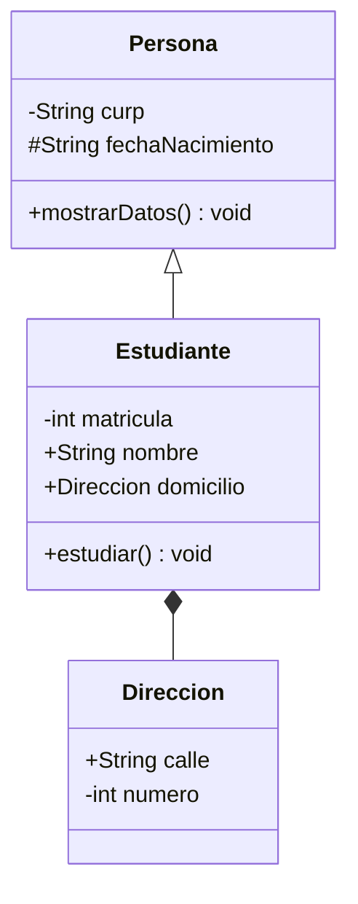

# Documentación del Proyecto: Generador de Diagramas de Clases UML (vía Mermaid JS)

Este proyecto es una herramienta avanzada diseñada para analizar código fuente escrito en **Java** y transformarlo en un **Diagrama de Clases UML interactivo** utilizando la sintaxis de **Mermaid JS**, el cual es exportado a un archivo **HTML interactivo y premium**.

---

## ✦ Arquitectura Técnica y Lógica de Implementación

El traductor se estructura sobre la base de un compilador de cuatro fases lógicas adaptado para el procesamiento del lenguaje Java:

### 1. Fase de Análisis Léxico (Lexer)
- **Clase modificada**: `PseudoLexer` y `TipoToken`
- **Operación**: Se incorporaron expresiones regulares para identificar palabras clave y símbolos de Java, tales como `class`, `extends`, `public`, `private`, `protected`, llaves `{}` y tipos de datos.
- **Robustez**: Se agregó soporte completo para detectar y omitir comentarios de línea (`// ...`) y comentarios de bloque (`/* ... */`) desde el inicio del análisis léxico, evitando conflictos con operadores como `/`. Asimismo, los caracteres desconocidos son agrupados y manejados como tokens `ERROR` para que el analizador sintáctico los gestione de forma flexible dentro del cuerpo de los métodos.

### 2. Fase de Análisis Sintáctico (Parser)
- **Clase modificada**: `PseudoParser`
- **Operación**: Analiza secuencialmente las declaraciones de clases de Java con la siguiente estructura básica esperada:
  - Modificador de acceso opcional (`public`, `private`, `protected`).
  - Palabra reservada `class` seguida del nombre de la clase.
  - Cláusula opcional `extends` para indicar la superclase.
  - Bloque `{` que contiene los miembros (atributos y métodos) y cierra con `}`.
- **Balanceo de llaves**: Para lograr una estabilidad absoluta y evitar la necesidad de parsear cada sentencia compleja dentro de los métodos (como llamadas de sistema, bucles internos o lógica aritmética), se implementó un algoritmo de balanceo de llaves. En cuanto el parser detecta el inicio de un cuerpo de método `{`, consume todos los tokens secuencialmente incrementando un contador de profundidad ante cada `{` y decrementándolo ante cada `}` hasta llegar a 0.

### 3. Extracción y Tabla de Símbolos
- **Clases del paquete**: `pseudo.symbols`
- **Operación**:
  - Las clases se registran como instancias de `ClassSymbol`, asociando su modificador de acceso y su superclase (`superClass`) para realizar un rastreo preciso de la herencia.
  - Los atributos de instancia se modelan como `VariableSymbol`, registrando su nombre, su tipo y modificador de acceso.
  - Los métodos se registran como `MethodSymbol`, guardando sus parámetros (nombres y tipos) y su tipo de retorno.

### 4. Generación y Visualización de Salida (Arquitectura Clean & SOLID)
Para cumplir rigurosamente con los principios de diseño de software moderno (**SOLID**), la lógica de generación y salida se ha descentralizado en componentes especializados con alta cohesión y bajo acoplamiento:
- **`ProgramReader` (Principio de Responsabilidad Única - SRP)**:
  - Clase encargada de manera exclusiva del acceso a archivos y lectura del código fuente original en formato UTF-8 de forma segura.
- **`MermaidCodeGenerator` (SRP)**:
  - Clase responsable de procesar la tabla de símbolos (`SymbolTable`) y mapear las clases, interfaces, tipos, miembros y estereotipos a la sintaxis exacta de **Mermaid JS**.
  - Mapea las siguientes relaciones UML:
    - **Herencia**: `SuperClase <|-- SubClase`
    - **Realización / Implementación**: `Interfaz <|.. Clase`
    - **Composición / Asociación**: `ClaseA *-- ClaseB` (detectado automáticamente si el tipo de un miembro coincide con el de otra clase en la tabla de símbolos).
    - **Modificadores de Visibilidad**: `public` ➔ `+`, `private` ➔ `-`, `protected` ➔ `#`, package-private ➔ `~`.
- **`HtmlReportGenerator` (SRP & OCP)**:
  - Se encarga de la inyección del código Mermaid generado en un lienzo HTML interactivo premium.
  - Ofrece un diseño moderno responsivo con visualización lado a lado (Diagrama UML renderizado dinámicamente frente al Código Fuente de Mermaid) y funcionalidad de copia con un clic, aplicando estética de *glassmorphism* de vanguardia, modo oscuro y tipografías `Outfit` y `Fira Code`.
- **`JavaToMermaidTranslator` (Orquestador)**:
  - Actúa estrictamente como el punto de entrada principal (`main`) que coordina y orquesta el flujo completo de traducción, logrando un diseño desacoplado y altamente escalable.

---

## ✦ Reglas de Traducción Soportadas

| Elemento Detectado en Java | Representación Interna | Sintaxis de Salida (Mermaid JS) |
| :--- | :--- | :--- |
| `public class Nombre` | `ClassSymbol` | `class Nombre {` |
| `private int edad;` | `VariableSymbol` | `-int edad` |
| `public String nombre;` | `VariableSymbol` | `+String nombre` |
| `protected void hacer();` | `MethodSymbol` | `#hacer() void` |
| `class A extends B` | `ClassSymbol` con `superClass` | `B <|-- A` |
| Variable de tipo Clase (`ClaseB obj;`) | `VariableSymbol` con tipo `ClassSymbol` | `ClaseA *-- ClaseB` (Composición/Agregación) |

---

## ✦ Manual de Usuario

### Paso 1: Requisitos Previos
1. Tener instalado el **Java Development Kit (JDK 8 o superior)**.
2. Contar con un archivo de código fuente de Java (ej. `Estudiante.java`) a analizar en el directorio del proyecto.

### Paso 2: Compilación del Proyecto
Para compilar todas las clases del traductor, ejecuta el siguiente comando en la terminal desde la raíz del proyecto:
```bash
javac -d bin -sourcepath src src/pseudo/lexer/*.java src/pseudo/parser/*.java src/pseudo/symbols/*.java src/pseudo/main/*.java src/pseudo/exceptions/*.java
```

### Paso 3: Ejecución de la Traducción (Soporte Multi-archivo y Directorios)
Ejecuta la herramienta indicando la ruta de un archivo `.java`, una lista de archivos, o el directorio que deseas escanear recursivamente:

* **Para procesar un solo archivo**:
  ```bash
  java -cp bin pseudo.main.JavaToMermaidTranslator ./Estudiante.java
  ```

* **Para procesar un directorio completo de forma recursiva**:
  ```bash
  java -cp bin pseudo.main.JavaToMermaidTranslator ./ruta/de/tu/proyecto
  ```

El sistema detectará automáticamente todos los archivos `.java`, acumulará sus clases y generará un único diagrama UML consolidado con todas las interconexiones detectadas entre clases de archivos distintos.

### Paso 4: Visualización del Diagrama UML
1. El programa generará de forma automática un archivo llamado `salida.html` en la raíz del proyecto.
2. Abre el archivo `salida.html` en cualquier navegador web moderno (Chrome, Edge, Firefox, Safari).
3. Podrás interactuar con la interfaz de última generación y observar el diagrama UML renderizado de forma dinámica, junto con estadísticas detalladas sobre el análisis de tus clases.

---

## ✦ Ejemplo de Ejecución Completo

### Código de Entrada (`Estudiante.java`):
```java
// ⋆˖⁺‧₊☽⛥Clase base para probar herencia⛥☾₊‧⁺˖⋆ //
public class Persona {
    private String curp;
    protected String fechaNacimiento;

    public void mostrarDatos() {
        System.out.println("CURP: " + curp);
    }
}

// ⋆˖⁺‧₊☽⛥Clase para probar relacion de composicion⛥☾₊‧⁺˖⋆ //
public class Direccion {
    public String calle;
    private int numero;
}

// ⋆˖⁺‧₊☽⛥Clase principal que hereda de Persona y contiene Direccion⛥☾₊‧⁺˖⋆ //
public class Estudiante extends Persona {
    private int matricula;
    public String nombre;
    
    // Composicion/Agregacion con Direccion
    public Direccion domicilio;

    public void estudiar() {
        if (matricula > 0) {
            System.out.println(nombre + " esta estudiando.");
        }
    }
}
```

### Código Mermaid Generado e Inyectado:


---

## ✦ Resolución de Errores e Incidencias Técnicas

Durante la fase de integración y renderizado web interactivo con **Mermaid JS**, se identificaron y resolvieron dos problemas críticos que provocaban el fallo `"Syntax error in text"` en el navegador:

### 1. Corrupción de Sintaxis por Interpretación del DOM (Escapado HTML)
* **Incidencia**: Los diagramas de clases UML contienen caracteres `<` y `>` para representar relaciones de herencia (`<|--`), realización (`<|..`) y estereotipos (`<<abstract>>`, `<<interface>>`). Si se inyectan directamente en el bloque `<pre class="mermaid">`, el analizador del navegador los interpreta erróneamente como etiquetas HTML inválidas o mal cerradas, destruyendo y corrompiendo la estructura de texto del DOM antes de que Mermaid JS la intente compilar.
* **Solución**: Se implementó el escapado HTML estricto transformando dichos caracteres a entidades web (`&lt;` y `&gt;`). De esta manera, el navegador los trata como texto puro y Mermaid JS los lee e interpreta correctamente sin interferencias en el DOM.

### 2. Sensibilidad a Espacios en Blanco en Contenedores `<pre>`
* **Incidencia**: La etiqueta `<pre>` conserva de manera exacta todos los saltos de línea, tabulaciones y sangrados definidos en la plantilla del código Java. El sangrado decorativo introducía espacios iniciales antes de la declaración de `classDiagram`, lo cual es interpretado por Mermaid JS como un fallo de sintaxis.
* **Solución**: Se eliminaron los saltos de línea y el espaciado interno en la declaración de la etiqueta en `HtmlReportGenerator.java`, y se aplicó la función `.trim()` a la variable del código generado para asegurar que el texto comience de forma limpia en el primer carácter útil.

---

## ✦ Integrantes del Proyecto
- **Deraz Labrador Emmanuel** (2208862)
- **Salazar Leal Javier Issac** (2208260)
